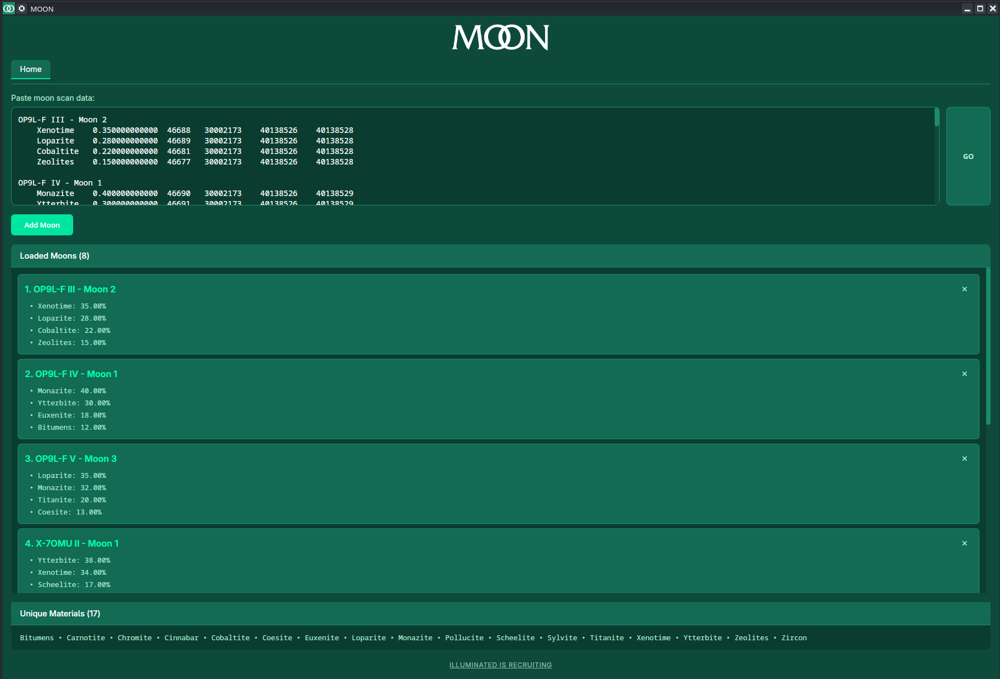
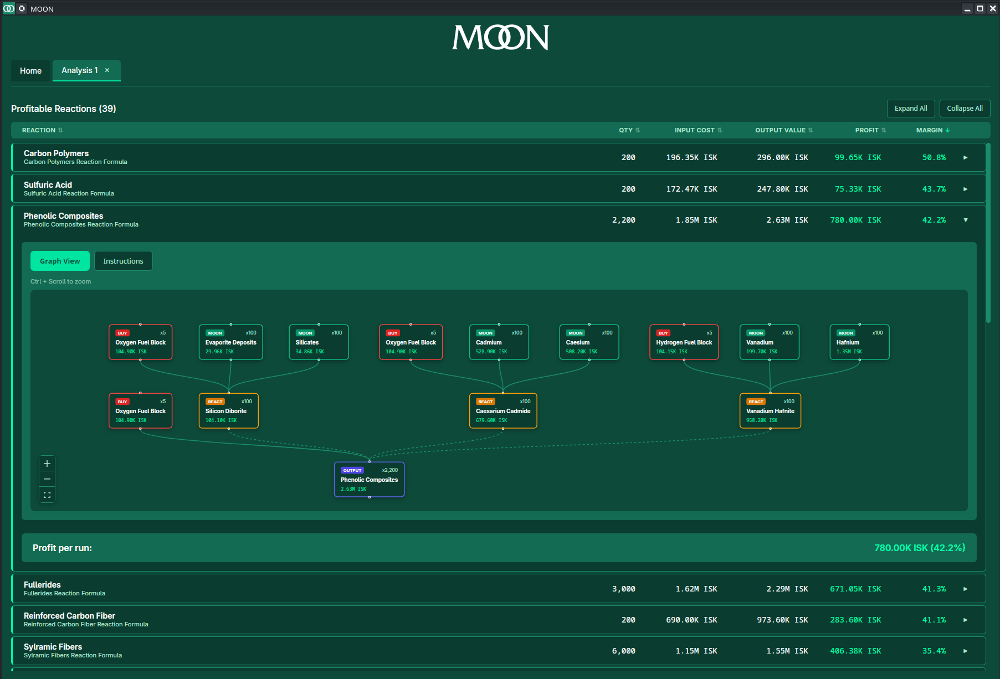

<p align="center">
  
</p>

<p align="center">
  <em>An advanced Eve Online moon goo reaction calculator</em>
</p>

<p align="center">
  <a href="https://www.illuminatedcorp.com" target="_blank">ILLUMINATED IS RECRUITING</a>
</p>

## What it does

- Parses moon survey scan data from the game
- Maps moon ores to the goo materials they produce
- Fetches live prices from Goonpraisal (Jita)
- Calculates profit margins for all possible reactions using your materials
- Shows the full production chain, including multi-stage reactions

All inputs are priced at their sell value (opportunity cost), so the profit shown is what you gain by reacting instead of selling raw materials.

## Usage

1. In EVE, run a moon survey scan
2. Copy the results from the survey window
3. Paste into MOON and click "Add Moon"
4. Repeat for additional moons if desired
5. Click "GO" to analyze

Results show profitable reactions sorted by margin. Expand any row to see the full production tree.

## Building from source

Requires Node.js and Rust.

```
npm install && npm run tauri dev
```

## Downloads

See [Releases](../../releases) for pre-built binaries for Windows, macOS, and Linux.

## Data sources

- Prices: [Goonpraisal](https://appraise.gnf.lt/) (Jita market)
- Reaction formulas and ore mappings are bundled with the app

## Screenshots





## License

This project is licensed under the GNU General Public License v3.0 - see the [LICENSE](LICENSE) file for details.
